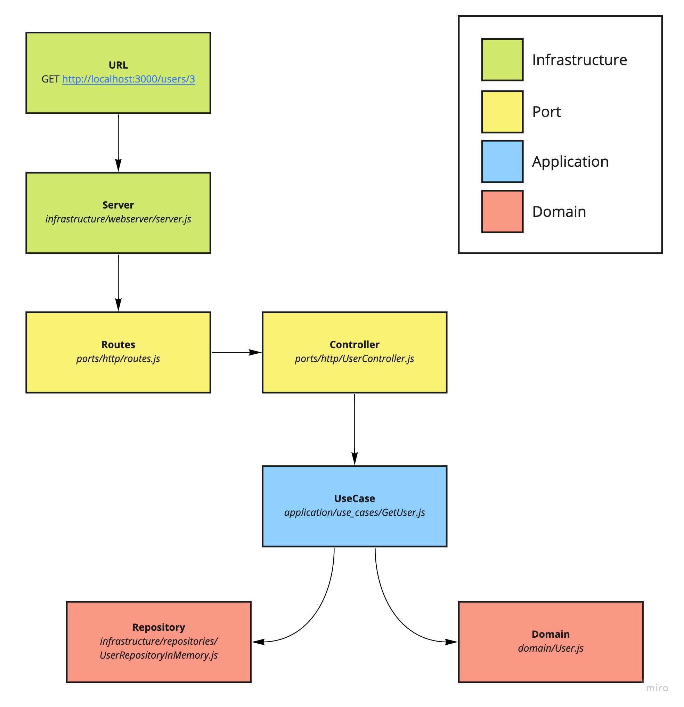

Node Clean Architecture

Clean Architecture emphasizes the separation of concerns and modularity. It ensures that the core business logic is decoupled from external dependencies and technologies. This separation enhances maintainability, testability, and adaptability. It allows you to make changes or swap out components (UI, database, etc.) with minimal impact on the core functionality.

Clean Architecture is a design philosophy that encourages well-structured, maintainable, and flexible software systems, making it easier to adapt to changing requirements and technologies.

The Dependency Rule

The overriding rule that makes this architecture work is The Dependency Rule. This rule says that source code dependencies can only point inwards. Nothing in an inner circle can know anything at all about something in an outer circle. In particular, the name of something declared in an outer circle must not be mentioned by the code in the an inner circle. That includes, functions, classes. variables, or any other named software entity.

Extracted from https://blog.cleancoder.com/uncle-bob/2012/08/13/the-clean-architecture.html#the-dependency-rule

Typical Request

